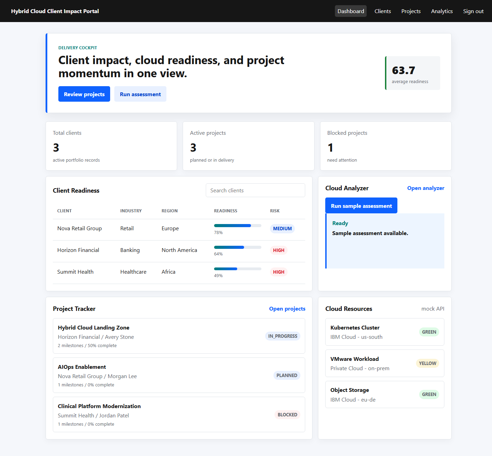
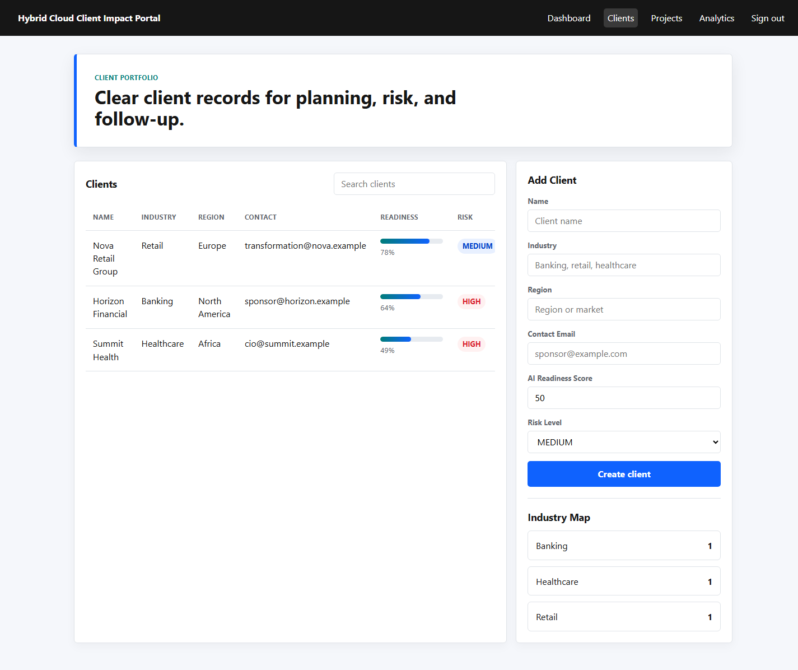
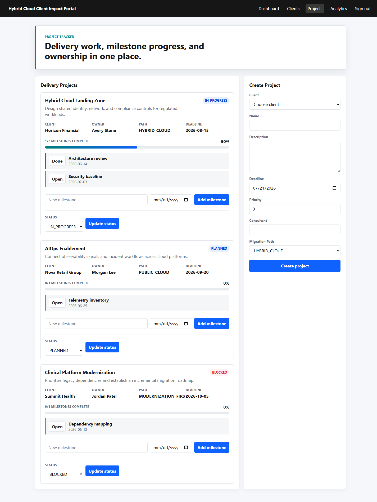
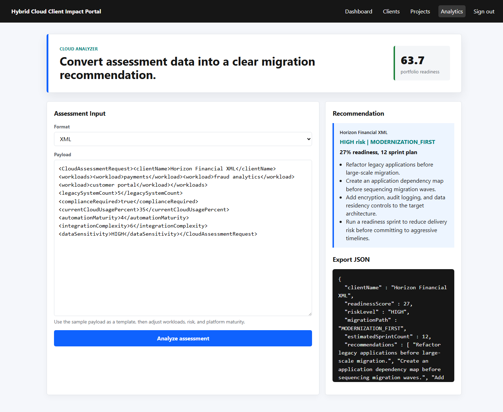

# Hybrid Cloud Client Impact Portal

Hybrid Cloud Client Impact Portal is a Java Spring Boot portfolio application that simulates an enterprise consulting platform for clients moving toward hybrid cloud and AI-enabled operations. It includes role-based login, client management, project tracking, JSON/XML cloud assessment analysis, REST APIs, mock cloud resources, logging, and automated tests.

GitHub repository:

```text
https://github.com/slyskenk/hybrid-cloud-client-impact-portal
```

## Purpose

The portal demonstrates how a Java application developer can turn consulting discovery data into a usable delivery workspace. It gives an enterprise client and consulting team a shared view of cloud readiness, migration risk, delivery milestones, and recommendation outputs.

## Primary Use Cases

- Assess a client's cloud and AI readiness from JSON or XML assessment data.
- Track consulting projects, owners, migration paths, deadlines, statuses, and milestones.
- Maintain a searchable portfolio of client profiles with readiness and risk signals.
- Expose REST endpoints so client, project, and analytics data can be integrated with other systems.
- Demonstrate role-based access for Admin, Consultant, and Client users.

## How The App Works

1. Sign in with a demo account.
2. Review portfolio health on the dashboard.
3. Add or search client records on the Clients page.
4. Create delivery projects, update status, and complete milestones on the Projects page.
5. Paste a JSON or XML cloud assessment into Analytics to generate a migration recommendation and exportable JSON output.
6. Use the REST API for integration-style access to clients, projects, and analytics.

## Screenshots

### Dashboard



### Clients



### Projects



### XML Analytics



## IBM Consulting Alignment:

- Java OOP: domain inheritance, encapsulated entities, services, DTOs, enums, and validation.
- Core CS: lists, maps, grouping, sorting, search, and rule-based recommendation logic.
- Web technologies: Spring MVC, Thymeleaf, HTML, CSS, and JavaScript with no external CDN requirement.
- REST architecture: `/api/clients`, `/api/projects`, `/api/analytics`.
- Data integration: JSON and XML cloud assessment import, analysis, and JSON export.
- Collaboration workflow: Admin, Consultant, and Client roles.
- Troubleshooting: SLF4J logging, centralized exception handling, Maven tests, and GitHub Actions CI.

## Features

- Dashboard with portfolio metrics, client readiness, project status, and mock cloud resources.
- Client page with searchable client table and client creation form.
- Project page with project creation, milestone tracking, and status update workflow.
- Analytics page that accepts JSON or XML assessments and produces migration recommendations.
- API endpoints protected with HTTP Basic auth for integration-style testing.
- H2 in-memory database seeded with sample consulting data at startup.

## Demo Accounts

| Role | Username | Password |
| --- | --- | --- |
| Admin | `admin` | `admin123` |
| Consultant | `consultant` | `consult123` |
| Client | `client` | `client123` |

## Requirements

- Java 17 or newer
- Maven 3.9 or newer
- Windows PowerShell for the helper scripts

The project is compiled for Java 17. It was also tested locally with Java 24.

## Build

Using a global Maven install:

```powershell
mvn package
```

Using the local Maven install included in this workspace:

```powershell
tools\apache-maven-3.9.16\bin\mvn.cmd "-Dmaven.repo.local=.m2\repository" package
```

Using the helper script:

```powershell
.\scripts\build.ps1
```

The build creates:

```text
target\hybrid-cloud-client-impact-portal-0.1.0-SNAPSHOT.jar
```

## Run The Application

Run directly from source:

```powershell
mvn spring-boot:run
```

Run the packaged JAR:

```powershell
java -jar target\hybrid-cloud-client-impact-portal-0.1.0-SNAPSHOT.jar
```

Run on another port:

```powershell
java -jar target\hybrid-cloud-client-impact-portal-0.1.0-SNAPSHOT.jar --server.port=8081
```

Run with the helper script:

```powershell
.\scripts\run-jar.ps1
.\scripts\run-jar.ps1 -Port 8081
```

Then open:

```text
http://localhost:8080/login
```

## H2 Database Console

The H2 console is available to the Admin role:

```text
http://localhost:8080/h2-console
```

Use:

```text
JDBC URL: jdbc:h2:mem:impactportal
User: sa
Password:
```

The database is in-memory, so data resets each time the app restarts.

## API Examples

List clients:

```powershell
curl.exe -u consultant:consult123 http://localhost:8080/api/clients
```

List analytics summary:

```powershell
curl.exe -u consultant:consult123 http://localhost:8080/api/analytics
```

Analyze a JSON cloud assessment:

```powershell
curl.exe -u consultant:consult123 `
  -H "Content-Type: application/json" `
  -d "@samples/cloud-assessment.json" `
  http://localhost:8080/api/analytics/recommendations
```

Analyze an XML cloud assessment:

```powershell
curl.exe -u consultant:consult123 `
  -H "Content-Type: application/xml" `
  -d "@samples/cloud-assessment.xml" `
  http://localhost:8080/api/analytics/recommendations/xml
```

Create a consulting project:

```powershell
curl.exe -u consultant:consult123 `
  -H "Content-Type: application/json" `
  -d "{\"clientId\":1,\"name\":\"Cloud Landing Zone\",\"description\":\"Design secure hybrid cloud foundations.\",\"deadline\":\"2026-08-15\",\"priority\":1,\"assignedConsultant\":\"Avery Stone\",\"migrationPath\":\"HYBRID_CLOUD\"}" `
  http://localhost:8080/api/projects
```

Add a project milestone:

```powershell
curl.exe -u consultant:consult123 `
  -H "Content-Type: application/json" `
  -d "{\"title\":\"Executive checkpoint\",\"targetDate\":\"2026-07-18\",\"complete\":false}" `
  http://localhost:8080/api/projects/1/milestones
```

Mark a milestone complete:

```powershell
curl.exe -u consultant:consult123 `
  -X PATCH `
  -H "Content-Type: application/json" `
  -d "{\"complete\":true}" `
  http://localhost:8080/api/projects/1/milestones/2
```

## Software Verification And Validation

Run the full Maven verification lifecycle:

```powershell
mvn verify
```

Or with the local Maven install:

```powershell
tools\apache-maven-3.9.16\bin\mvn.cmd "-Dmaven.repo.local=.m2\repository" verify
```

Run tests only:

```powershell
mvn test
```

Or with the local Maven install:

```powershell
tools\apache-maven-3.9.16\bin\mvn.cmd "-Dmaven.repo.local=.m2\repository" test
```

Current automated SV&V coverage includes:

- Cloud recommendation scoring.
- Anonymous web redirect behavior.
- Consultant page access.
- Client role access restrictions.
- Client and project web form creation.
- HTTP Basic API access.
- JSON analyzer endpoint behavior.
- XML analyzer endpoint behavior.
- JSON and XML analytics web form behavior.
- Recommendation JSON export behavior.
- Client DTO validation and bad request handling.
- Project milestone creation and completion.
- Static resource and favicon handling.
- Malformed request payload handling.

Manual validation checklist used for browser QA:

- Sign in as `consultant / consult123`.
- Confirm dashboard metrics, client readiness table, project tracker, cloud resources, and sample assessment.
- Create a client profile.
- Create a project for that client.
- Update project status.
- Add and complete a milestone.
- Analyze a JSON assessment.
- Analyze an XML assessment.
- Confirm `/favicon.ico`, `/api/clients`, `/api/projects`, and `/api/analytics` return expected statuses.
- Scan application logs for new `ERROR`, `Unexpected application error`, static-resource, or exception entries.

Last local SV&V pass: May 21, 2026.

## Project Structure

```text
src/main/java/com/ibmjob/hybridportal
  config        security and seed data
  controller    MVC pages and REST APIs
  domain        JPA entities and enums
  dto           request/response and form objects
  repository    Spring Data repositories
  service       business logic and analysis engine

src/main/resources
  templates     Thymeleaf UI
  static        CSS and JavaScript

samples         JSON/XML cloud assessment examples
scripts         PowerShell build and run helpers
```

## Troubleshooting

If `mvn` is not recognized, use:

```powershell
tools\apache-maven-3.9.16\bin\mvn.cmd "-Dmaven.repo.local=.m2\repository" package
```

If port `8080` is already in use, run on another port:

```powershell
java -jar target\hybrid-cloud-client-impact-portal-0.1.0-SNAPSHOT.jar --server.port=8081
```

If the JAR cannot be rebuilt because it is locked, stop the running app process first:

```powershell
Get-NetTCPConnection -LocalPort 8080
Stop-Process -Id <OwningProcess>
```

Java 24 may print native access warnings from embedded Tomcat. They do not block the app. Java 17 or 21 is recommended for a quieter portfolio demo.

## Portfolio Story

This project can be presented as a consulting delivery platform: client profiles capture readiness and risk, consultants manage transformation projects, and the analyzer converts enterprise cloud assessment data into practical migration recommendations.

## Suggested Next Enhancements

- Add PostgreSQL profile for deployment.
- Add OpenAPI documentation.
- Add user persistence instead of in-memory demo users.
- Add milestone due-date reminders and overdue indicators.
- Deploy to Render, Railway, Azure App Service, or IBM Cloud.
